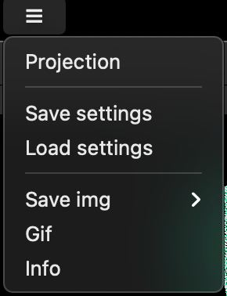
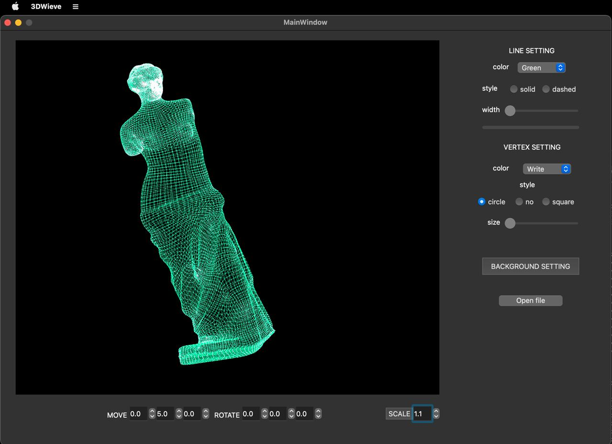

# Simple 3DViewer

## Info
A simple program for viewing wireframe models from .obj files

## Dependencies
1. Qt6.2 + QtOpenGLWidgets + OpenGL
2. gcc + g++
3. Make and CMake

## Install
1. Download the repository
2. cd to src folder
3. Type `make install`
4. Go to Desktop and run program **3DViewer**

## Uninstall
Go to src folder and type `make uninstall` or just delete app icon

## Usage
- Load a wireframe model from an obj format file (supports only a list of vertices and surfaces).
- Choose the color of lines, background, vertices.
-Move the model by a given distance relative to the X, Y, Z axes.
- Rotate the model by a given angle relative to its X, Y, Z axes.
- Scale the model by the specified value.
- Allows you to customize the type of projection (parallel and central).
- Allows you to customize the type (solid, dotted), the color and thickness of the edges, the display method (missing, circle, square), the color and size of the vertices.
- Save settings before exiting the program.
- Load the settings of a save made earlier.
- Get information about the file in info.
- Save the received ("rendered") images to a bmp and jpeg file.
- Record the current user affine transformations of the uploaded object into a gif animation.

## Created and tested on MacOS by v3ssel and crackedg in 2022